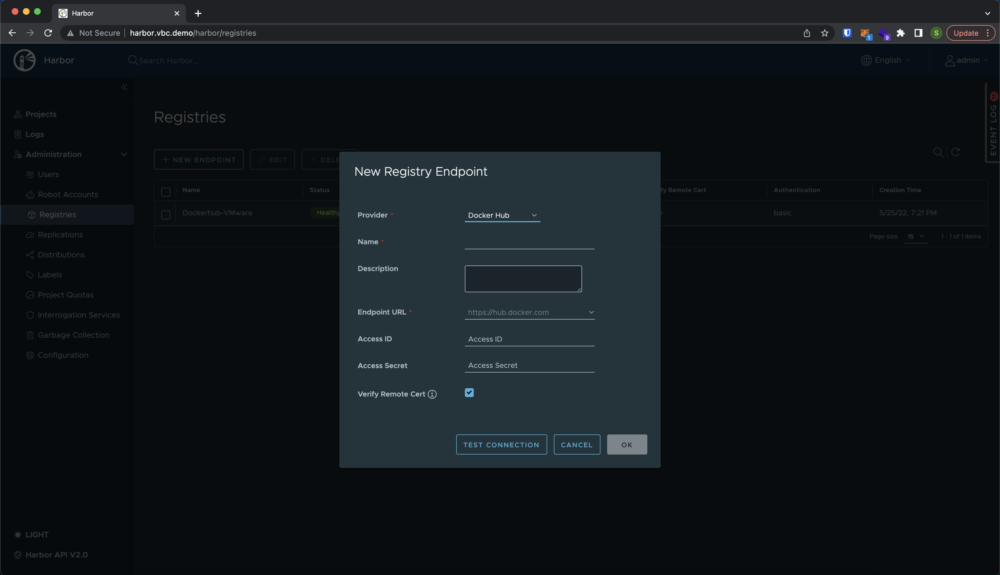
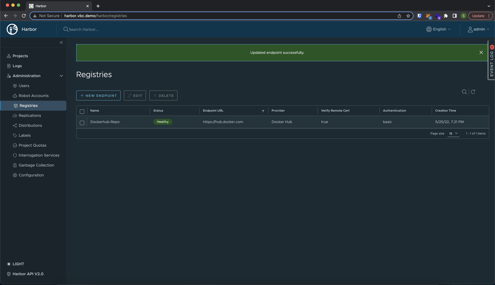
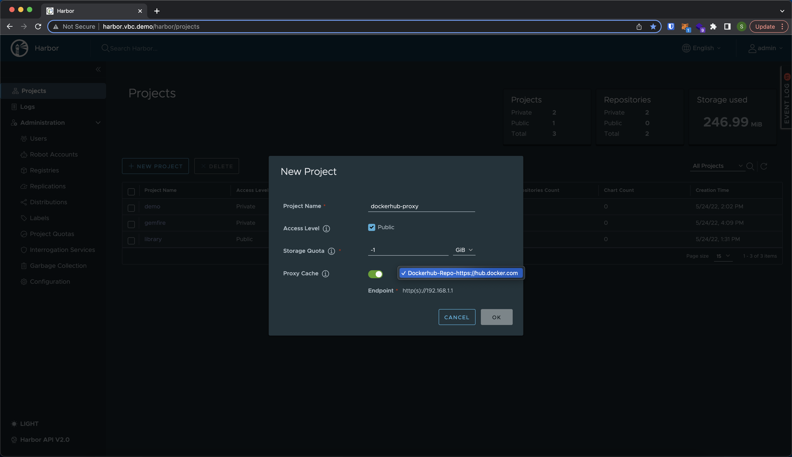
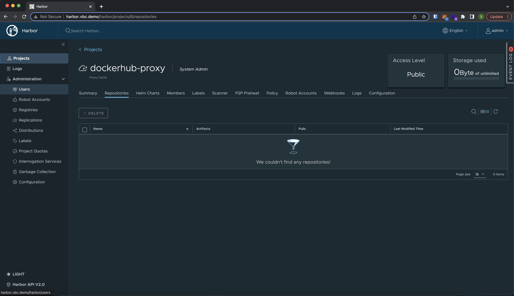
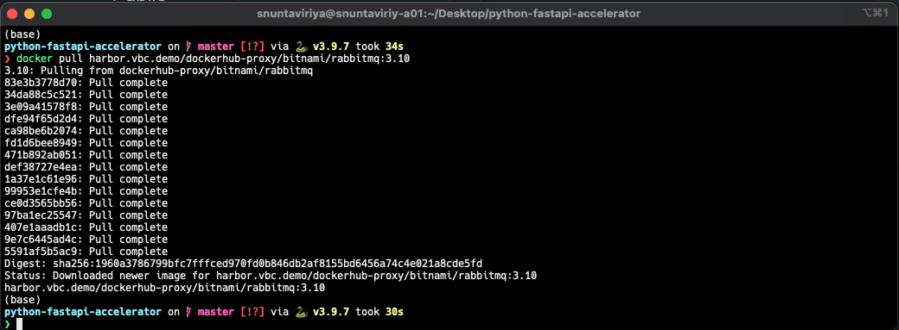
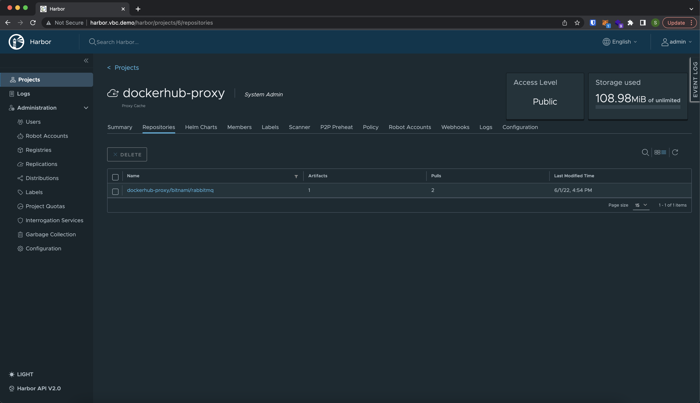

สำหรับ Developer ที่มีการใช้ Dockerhub เป็นที่เก็บ Container image ถ้าเรามีการใช้คำสั่ง `docker pull` บ่อยๆบางทีก็อาจจะเจอ Error ชน Rate Limit

```bash
You have reached your pull rate limit. You may increase the limit by authenticating
and upgrading: https://www.docker.com/increase-rate-limits
```

หลังจากที่ Dockerhub มีการเปลี่ยน Policy ในการ Push / Pull Image จาก Registry หลายๆคนก็อาจจะพบกับข้อความนี้ ซึ่งก็อาจส่งผลต่อการ Develop, Deploy หรือ Scale Pod บน k8s cluster ซึ่งจะติดอยู่ใน `Pending` state ทำให้ไม่สามารถ Scale หรือ Update ตัว Deployment ได้

วันนี้เราจะมาแนะนำวิธีการใช้ Harbor ซึ่งเป็น Opensource Registry และเป็น Project ใน CNCF ในการแก้ไขปัญหาติด Rate Limit โดยการทำ Registry Proxy.

**Prerequisites:**

- Harbor ใน [Docker](https://goharbor.io/) (ใน Demo เป็น Version 2.5.0)
- Deploy Harbor ผ่าน [TKG Extension](https://docs.vmware.com/en/VMware-vSphere/7.0/vmware-vsphere-with-tanzu/GUID-2B3F2498-7BE3-4179-9F92-C83902061D42.html)
- Deploy ผ่าน [Helm](https://goharbor.io/docs/2.5.0/install-config/harbor-ha-helm/) ลงบน k8s cluster

```bash
helm repo add harbor https://helm.goharbor.io
helm fetch harbor/harbor --untar
```


**สร้าง Registry Endpoint**

1. ไปที่ Administration -> Registries เลือก New Endpoint
2. เลือก Provider เป็น `Docker Hub`
   

3. ในกรณีที่เป็น Private Repository สามารถใส่ `Access ID` และ `Access Secret` ได้
4. ลอง Test Connection เพื่อทดสอบการ Access Dockerhub แล้วกด Ok
   

**สร้าง Dockerhub Proxy**

1. ไปที่ Projects -> New Project
2. ใส่ชื่อ Project Name เป็นชื่อ Proxy ที่ต้องการใช้
3. สามารถกำหนด Storage Limit ได้ ( -1 คือ No Limit )
4. เปิด Proxy Cache และเลือก Registry Endpoint ที่เราได้สร้างไว้ในตอนแรก
   

   จะได้เป็นหน้า Project ใหม่สำหรับเป็น Proxy Cache จาก Dockerhub

   

ทดสอบการ Pull ผ่าน Harbor Proxy โดยเติม `<HARBOR_IP>/<PROXY_PROJECT_NAME>/` เข้าไปด้านหน้า Image ที่ต้องการ Pull

เช่น

```bash
docker pull bitnami/rabbitmq:3.10
```

แก้เป็น

```bash
docker pull harbor.vbc.demo/dockerhub-proxy/bitnami/rabbitmq:3.10
```



Image ที่เราทำการ Pull จะถูกเก็บไว้ใน Cache ของ Harbor



---

Useful Links:

[Harbor project repository](https://github.com/goharbor/harbor)  
[VMware Harbor Registry](https://docs.vmware.com/en/VMware-Harbor-Registry/services/vmware-harbor-registry/GUID-index.html)
