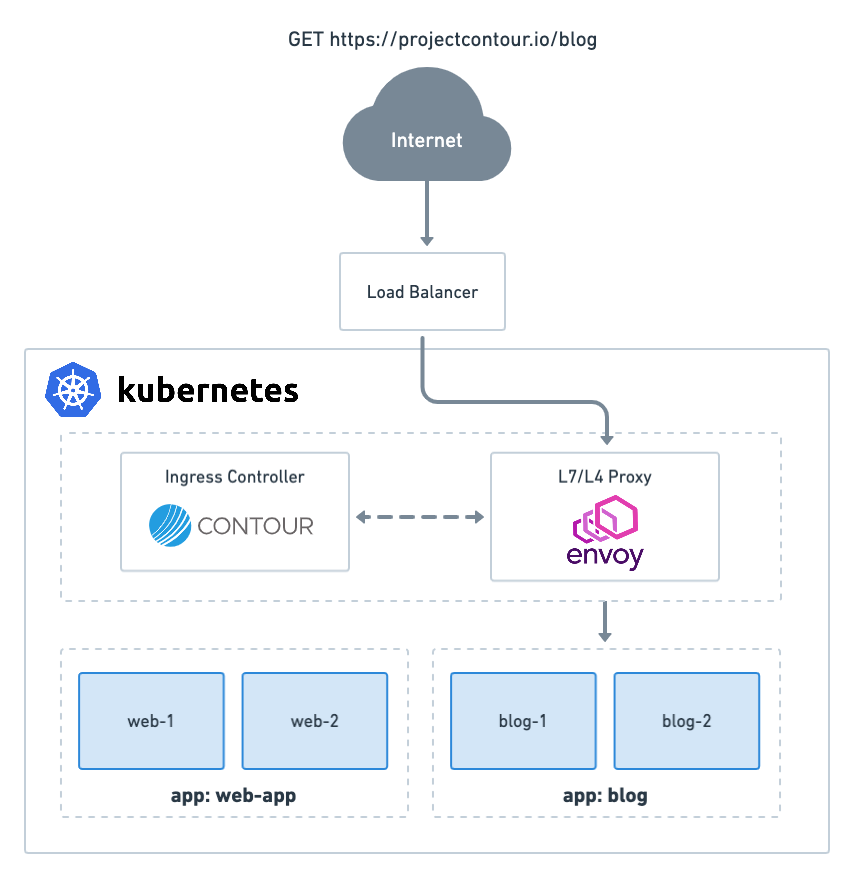

วันนี้เราจะมาลองสร้าง Kubernetes Ingress ด้วย Contour กัน. Contour เป็น Ingress Controller ( Layer 7 ) สำหรับ Kubernetes cluster ที่ใช้
<a href="https://www.envoyproxy.io/" target="_blank">Envoy Proxy</a> ในการทำ Reverse Proxy และ Loadbalancer โดย VMware ( Heptio ) เป็นคนเริ่มพัฒนา Project Contour ก่อนที่จะส่งต่อให้กับทาง CNCF ซึ่งปัจจุบันอยู่ในสถานะ Incubating

## Contour Architecture

---


*https://projectcontour.io/docs/v1.21.0/architecture/*

Contour จะ Route traffic ตาม Rule ของ Ingress และ <a href="https://projectcontour.io/docs/v1.21.0/config/fundamentals/" target="_blank">HTTPProxy</a> ( CRDs ของ Contour ) ซึ่งจะทำให้สามารถใช้งาน Load balancing, Header-based routing และ TLS cert delegation และ Feature อื่นๆที่ไม่สามารถทำได้โดยใช้ k8s Ingress ปกติได้

Envoy จะอยู่ในส่วน Data plane และคุยกับ Contour โดยใช้ gRPC stream ซึ่งจะทำให้สามารถ Update Configuration โดยที่ไม่ต้อง Restart Pod ของ Envoy

## Installation

---

Contour สามารถ Deploy ได้ทั้งบน GKE, AKS, EKS, Local kind cluster หรือ Cluster ที่รองรับการใช้ Service `LoadBalancer`

Option 1. Install ผ่าน YAML file โดยใช้คำสั่ง

```bash
kubectl apply -f https://projectcontour.io/quickstart/contour.yaml
```

Option 2. ใช้ Helm chart

```bash
helm repo add bitnami https://charts.bitnami.com/bitnami
helm install contour bitnami/contour --namespace projectcontour --
create-namespace
```

สามารถเช็คสถานะของ Pod หลังจากการ Install โดยใช้คำสั่ง

```bash
❯ kubectl get po -n projectcontour
NAME                               READY   STATUS    RESTARTS   AGE
contour-contour-79ffc467cf-tzk7r   1/1     Running   0          12d
contour-envoy-gjx9v                2/2     Running   0          12d
contour-envoy-nssrw                2/2     Running   0          14d
```

**เปรียบเทียบการสร้าง k8s Ingress vs HTTPProxy**

<script src="https://gist.github.com/guyzsarun/d0ecd9231bb93e90de838be2e6fb6251.js"></script>

ในฝั่ง Contour จะมีการใช้ `virtualhost` ซึ่งเป็น root HTTPProxy แทนการใช้ `host` ของ k8s Ingress

<script src="https://gist.github.com/guyzsarun/96bf2e85f6d89daee929667897ddacdd.js"></script>

ซึ่งเราสามารถเช็ค Status ของ HTTPProxy ได้โดยใช้คำสั่ง

```bash
❯ kubectl get proxy
NAME         FQDN           TLS SECRET   STATUS   STATUS DESCRIPTION
basic        foo-basic.bar.com           valid    Valid HTTPProxy
```

**การทำ Path Rewriting**

เช่นเดียวกับการใช้ annotations `nginx.ingress.kubernetes.io/rewrite-target` ในการทำ Rewrite path. Contour จะมีการใช้ `pathRewritePolicy` ในการทำหนด Path ที่ต้องการ Rewrite

<script src="https://gist.github.com/guyzsarun/67f7563f5f50a462d009e15406a5b8f8.js"></script>

เมื่อมี Request มาที่ `foo-basic.bar.com/api/v1` Contour จะทำการ forward connection ไปยัง service s1 ที่ port 80 รวมถึงทำการ rewrite เป็น `foo-basic.bar.com`

**การทำ Upstream Weighting**


*https://www.optimizely.com/optimization-glossary/canary-testing/*

Contour Support การทำ <a href="https://www.optimizely.com/optimization-glossary/canary-testing/" target="_blank">Canary testing / Blue-green deployment </a>ซึ่งใช้ในการ Release software หรือ Service ไปหา User จำนวนน้อย โดยทำการ Split traffic ส่วนหนึ่งไปหา Application version ใหม่เพื่อทำการ Test หรือเก็บ User feedback ก่อนการทำการ Deploy

<script src="https://gist.github.com/guyzsarun/23317e7c495129f0ef6d8345bed564d0.js"></script>

โดยเราสามารถกำหนด weight ที่เข้าไปหา Service ต่างๆใน k8s cluster ของเราได้ โดยในตัวอย่าง 10% ของ Traffic จะเข้าไปที่ Service s1, 90% ของ Traffic จะเข้าไปที่ Service s2

- ถ้าไม่มีการกำหนด Weight ที่เข้าไปยัง Service, Traffic จะถูก Route ไปทุกๆ Service เท่าๆกัน
- Weight ที่กำหนดเป็น Relative และไม่จำเป็นต้องรวมกันครบ 100 เช่น ถ้ามีการแบ่ง Weight เป็น 30 กับ 40. Total Weight = 30+40 = 70.
  - จะมีการแบ่ง Traffic เป็น (30/70=42.85%) และ (40/70=57.15%)
- ถ้ามีการใช้ Weight ในบาง Service, Service ที่ไม่มีการใช้ Weight จะถูก Assume ว่ามี Weight = 0

**การทำ Load Balancing**

Contour Support การทำ Load Balancing ทั้งหมด 5 รูปแบบ

1. RoundRobin (Default): Contour จะทำการกระจาย Load วนไปเรื่อยๆ ตามจำนวน Service ที่เรามี

   

   *https://www.myassignmenthelp.net/round-robin-scheduling-assignment-help*

2. WeightedLeastRequest: Load จะถูกแบ่งตาม Weight ของ Host และตามจำนวนของ Active Request/Connection ในตอนนั้น

3. Random: Load จะถูก Random ไปยัง Endpoint ที่ Healthy

4. RequestHash: Element ของ Request ที่เข้ามาจะถูก Hash ตาม Headers, Query parameters หรือ Source IP และส่งไปยัง Endpoint เดียวกัน

5. Cookie: สามารถใช้ทำ Session Affinity หรือ Sticky Sessions ได้ โดย Client จะถูก Route ไปที่ Service/Backend ตัวเดิม

**ตัวอย่างการกำหนด LoadBalancer**

<script src="https://gist.github.com/guyzsarun/9f5bec1c94e3664445e538766756084f.js"></script>

สามารถกำหนดได้ใน `strategy` โดยในตัวอย่างเป็นการใช้ RequestHash โดย Hash ที่ SourceIP. ในกรณีที่ Request มาจาก Source IP เดียวกัน จะทำการ LB ไปยัง Service ตัวเดิม

---

Useful Links:

[Contour project repository](https://github.com/projectcontour/contour)  
[Controlling Ingress with Contour](https://tanzu.vmware.com/developer/guides/controlling-ingress-with-contour/)
