วันนี้เราจะมาสอนวิธีการติดตั้ง Cloud Proxy บน vROps เพื่อไป Monitor Host machine ด้วย Protocol SNMP ( Simple Network Management Protocol )

ก่อนอื่นเรามาทำความเข้าใจ Protocol SNMP กันก่อน

**Simple Network Management Protocol (SNMP)**


SNMP เป็น Protocol ที่ Layer 7 ( Application Layer ) ในชุด TCP/IP (Transmission Control Protocol/Internet Protocol ) ซึ่ง Protocol SNMP สามารถใช้ในการ Monitor และ Manage network devices จาก IP เราสามารถใช้ Protocol นี้ในการจัดการอุปกรณ์ Router, Switch, Firewall หรือ Server ต่างๆ ที่อยู่ใน Network.

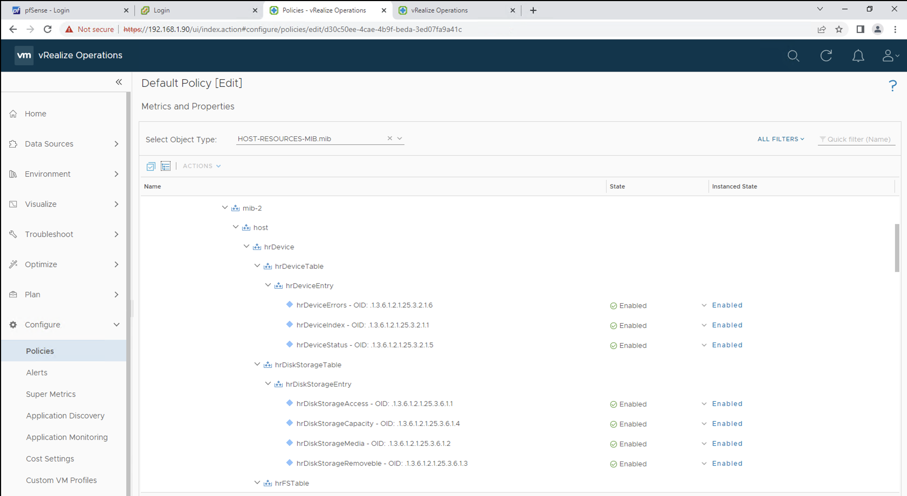

มีการใช้ MIB ( Management Information Base ) ในการเก็บหรือจัดการค่าต่างๆของอุปกรณ์ใน Network โดยจะจัดเก็บอยู่ในรูปแบบ Hierarchical format.

ใน 1 MIB สามารถใช้ในการ Manage ได้หลาย Object โดนเราสามารถระบุ OID (Object Identifier) เพื่อทำการแยก variable ต่างๆใน MIB Hierarchy ได้ ซึ่งเลข OID แต่ละตัวก็จะต่างกันในแต่ละ Vendor / Devices

เช่น OID `1.3.6.1.2.1.25.3.2.1` สามารถใช้ในการ​ Monitor `hrDeviceIndex`

```
iso (1)
.org (3)
.dod (6)
.internet (1)
.mgmt (2)
.mib-2 (1)
.host (25)
.hrDevice (3)
.hrDeviceTable (2)
.hrDeviceEntry (1)
.hrDeviceIndex (1)
```

**Port ที่ใช้งาน**

SNMP ใช้การสื่อสารแบบ UDP ( User Datagram Protocol ) ที่ Port 161/162

## Cloud Proxy

---

ใน vROps เราสามารถใช้ Cloud Proxy ในการเก็บข้อมูลและ Monitor จาก Remote Data Center และส่งข้อมูลกลับไปที่ vRealize Operations. โดยปกติแล้วเราจะใช้ Cloud Proxy เพียง 1 ตัว ต่อ 1 Physical Data Center

**Cloud Proxy Installation**

1. Login ไปที่ vRealize Operations

2. เลือก Data Sources -> Cloud Proxies กดที่ New

   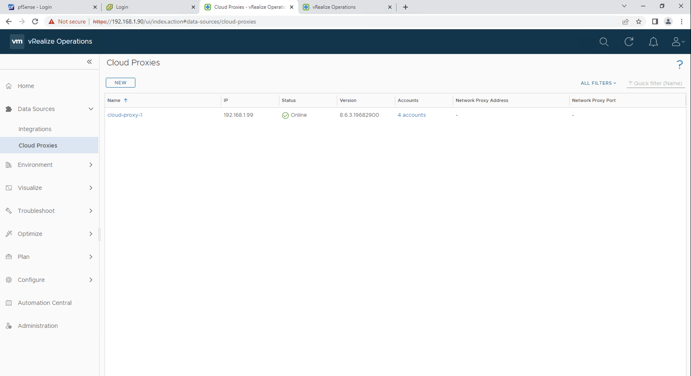

3. เลือก `Download Cloud Proxy OVA` และทำการ Save OVA ไว้ที่เครื่อง Local

   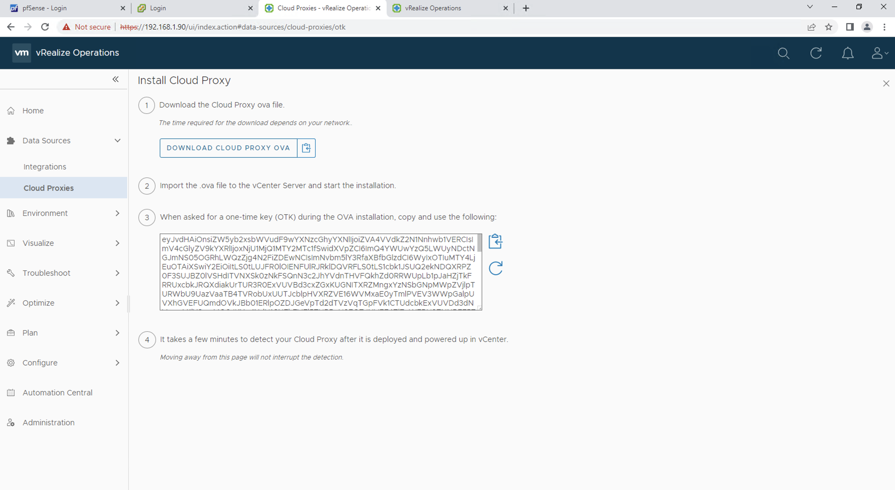

4. ที่หน้า vSphere Client เลือกที่ Cluster หรือ Folder ของเราที่ต้องการ Deploy Cloud Proxy แล้วกด `Deploy OVF Template`

   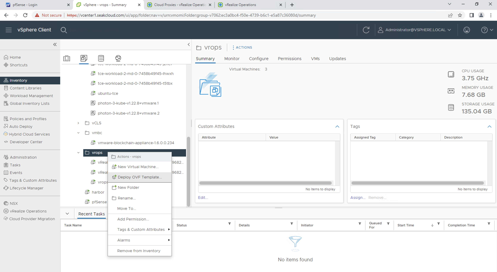

5. ตั้งค่า Name, Folder และ Resource Pool
6. ในส่วน Configuration ให้เลือกขนาดของ Cloud Proxy ให้เหมาะกับ Resource หรือจำนวน VM ที่ต้องการ Monitor

   > Small Cloud Proxy สำหรับ <8000 VMs จะใช้ 2 vCPUs และ Ram 8GB  
   > Standard Cloud Proxy สำหรับระหว่าง 8000–40000 VMs จะใช้ 4 vCPUs และ Ram 32GB

   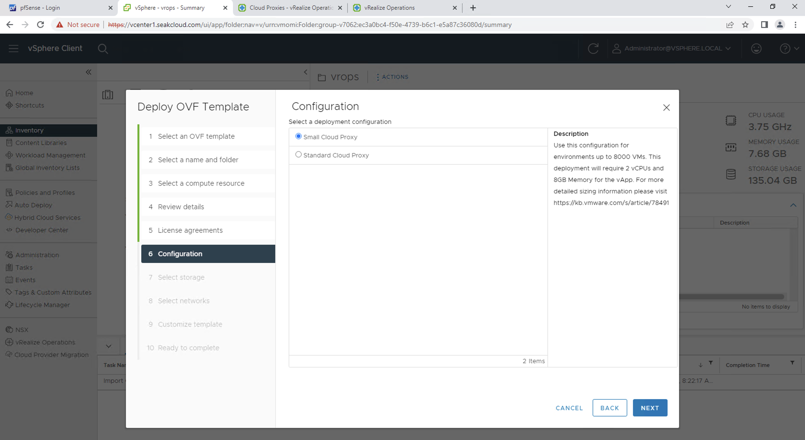

7. ในส่วนของการ Customize Template ทำการ Copy One Time Key จากขั้นตอนที่ 3 จาก vRealize Operations มาใส่

   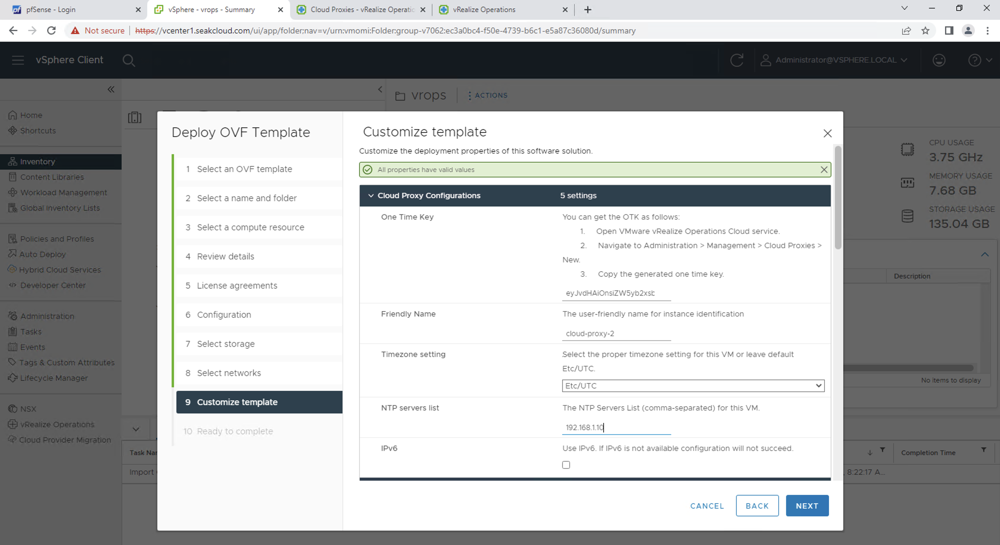

8. หลังจากใส่ Name, NTP Server ให้กด Finish เพื่อทำการสร้าง Cloud Proxy vApps
9. ในหน้า vSphere Client ทำการ Power-on VM

   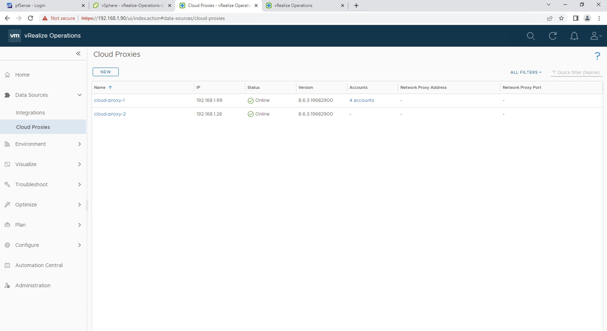

หลังจากทำการ Power-on Cloud Proxy VM และ VM ทำการ Initialize สามารถไปดู Cloud Proxy ที่เพิ่งถูกสร้างขึ้นใน vRealize Operations โดยเลือกไปที่ Data Sources -> Cloud Proxies

## SNMP Adapter  

---

เราสามารถ Download Management Packs มาใส่ให้ vROps เพื่อเพิ่มความสามารถในการ Monitor, Troubleshooting และ Remediation ของตัว SDDC.

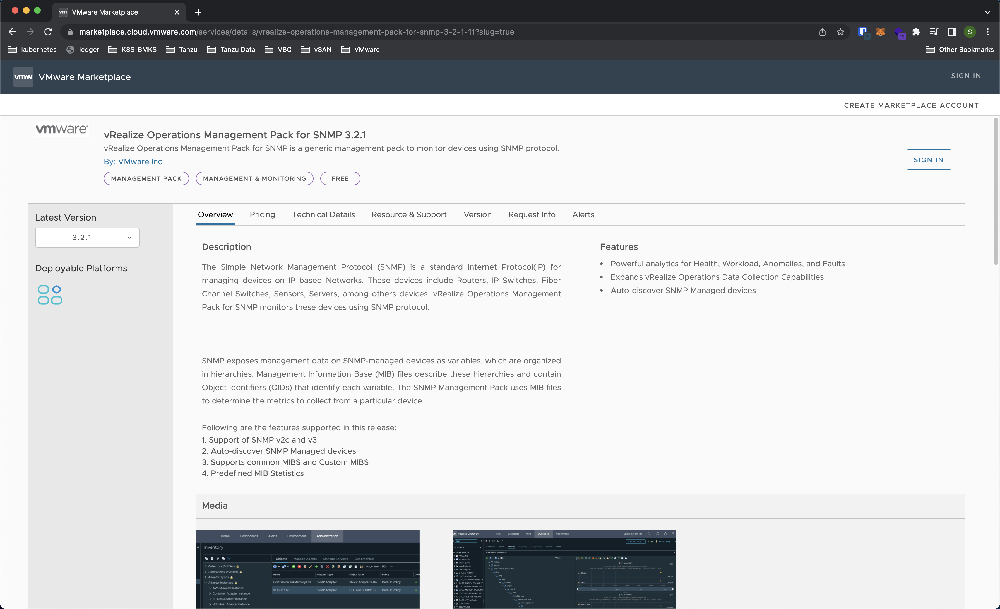

โดยในส่วนของ SNMP Adapter จะใช้ชื่อว่า VMware vRealize Operations Management Pack for SNMP ( ในตัวอย่างเป็น Version 3.2.1 ) สามารถ Download ได้จาก [VMware Marketplace](https://marketplace.cloud.vmware.com/)

**SNMP Adapter Installation**
1. เข้าไปที่ [VMware Marketplace](https://marketplace.cloud.vmware.com/) และ Download ไฟล์ PAK Management Pack ของ SNMP
2. เข้าไปที่ Data Sources -> Integrations แล้วกด ADD ใน Tab Repository

   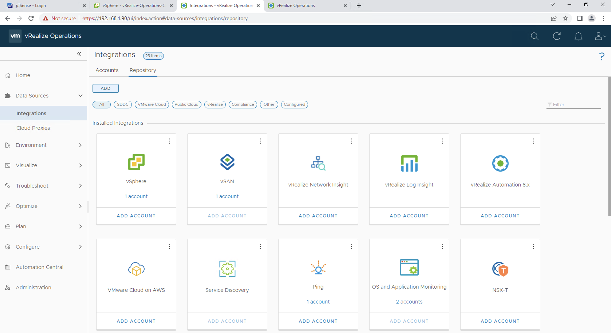

3. ทำการ Browse และ Upload ไฟล์ .PAK แล้วทำการ Accept EULA แล้วกด Finish

   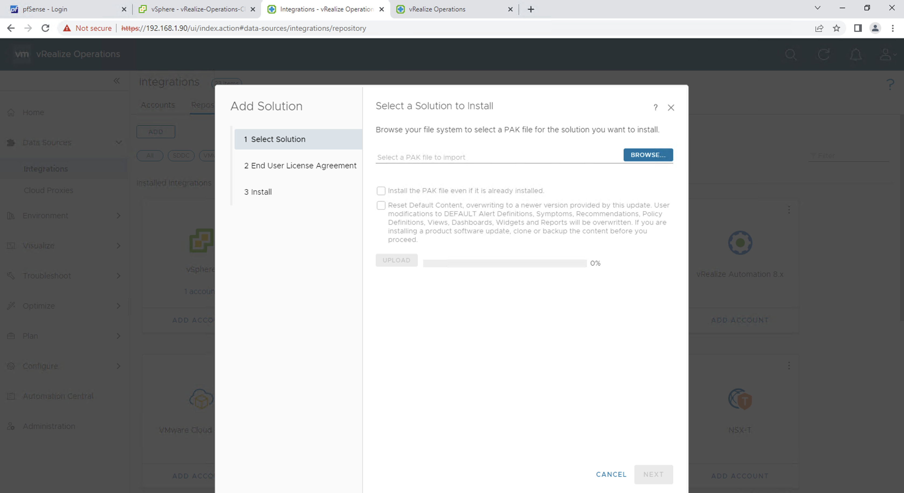

**SNMP Adapter Configuration**

1. เข้าไปที่ Data Sources -> Integrations แล้วกด Add Account
2. เลือก SNMP Adapter เพื่อสร้าง Adapter

   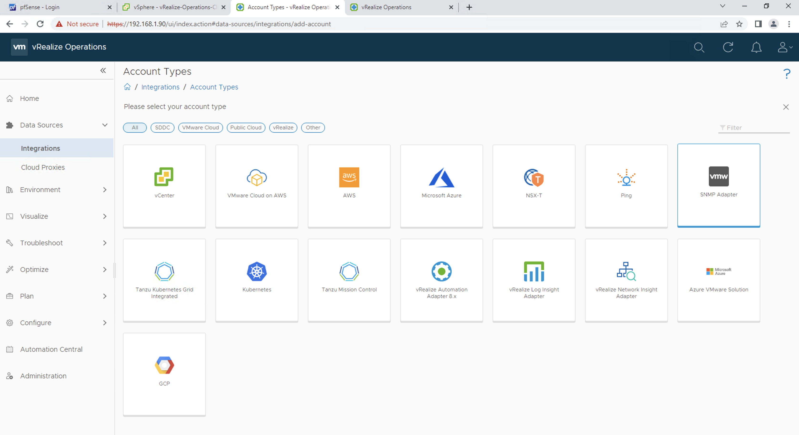

3. ทำการใส่ IP ของ Device ที่ต้องการ Monitor โดยสามารถกำหนดเป็น Range ของ IP ได้

   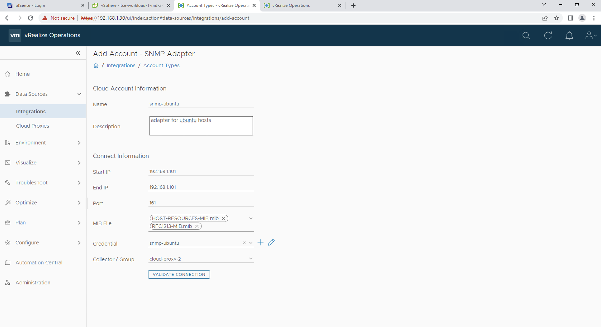

4. ในส่วนของ Credentials สามารถเลือกได้ทั้ง SNMPv2c และ SNMPv3 และใส่ Credentials รวมถึง Protocol ที่ใช้ในการ Authenticate

   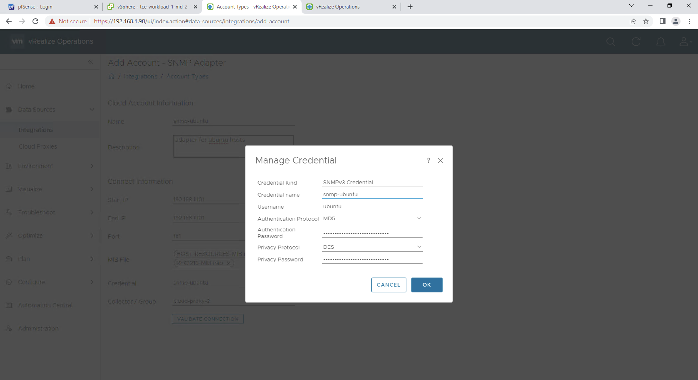

5. สามารถกด Validate Connection เพื่อทดสอบการเชื่อมต่อกับ Network Device ได้ แล้วกด ADD เพื่อทำการสร้าง Adapter
   
   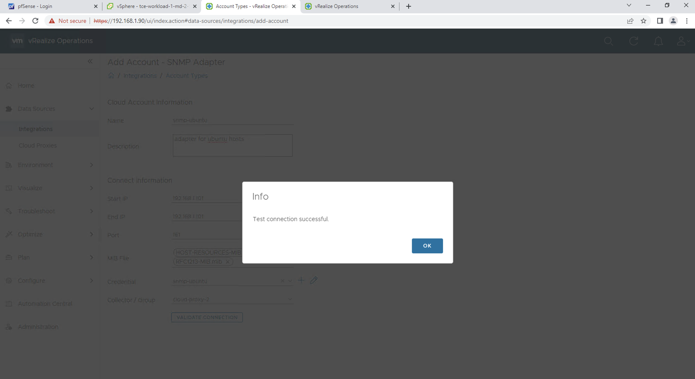

6. ไปที่ Environment -> Object Browser และเลือก SNMP Adapter เพื่อทำการ Monitor Device ต่างๆ หรือทำการ Create Dashboard ได้
   
   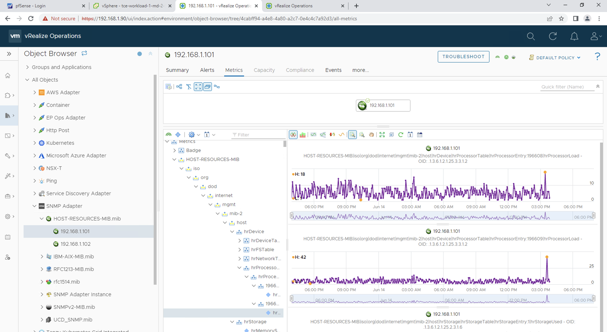

---
Useful Links:

[VMware vRealize-Operations](https://docs.vmware.com/en/vRealize-Operations/index.html)  
[VMware Marketplace](https://marketplace.cloud.vmware.com/services/details/vrealize-operations-management-pack-for-snmp-3-2-1-11?slug=true)

