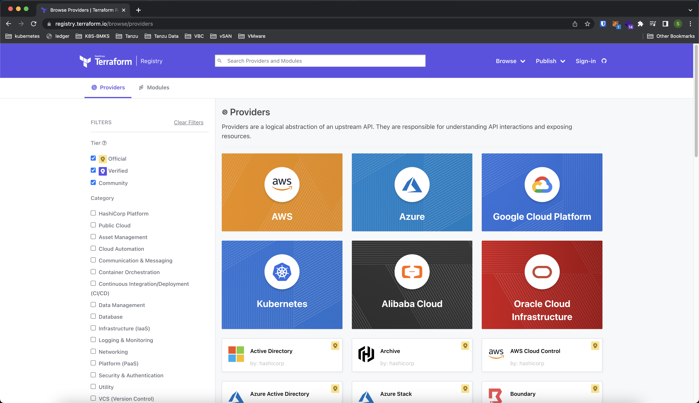
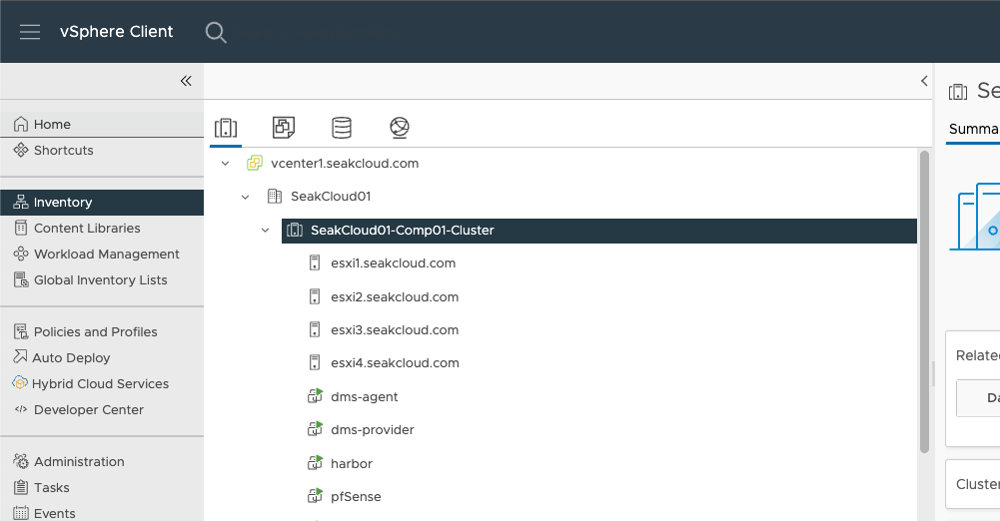
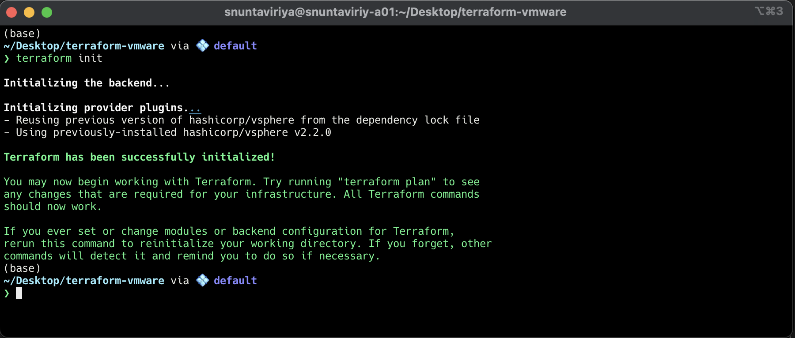
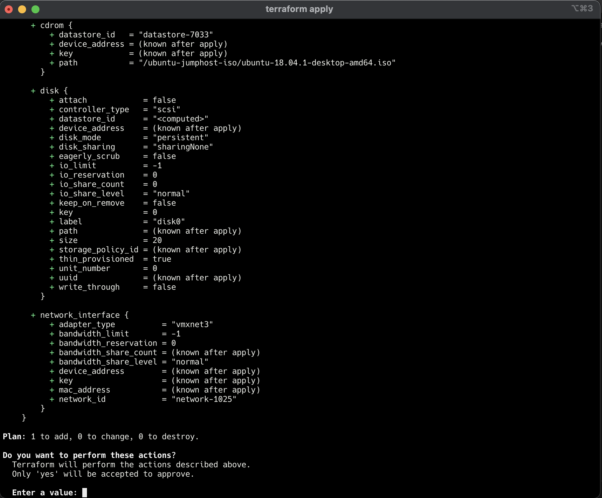
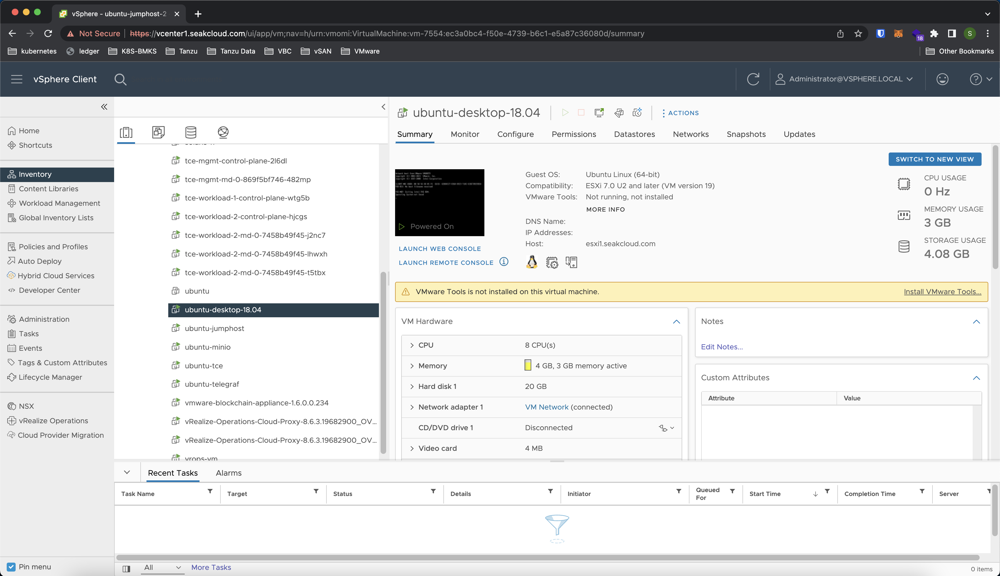

---
layout: post
title: "Manage vCenter with Terraform"
author: guyzsarun
categories: [vmware, terraform]
image: assets/images/manage-vcenter-with-terraform/terraform.jpeg
featured: true
--- 

This post will explain about what is [Terraform](https://www.terraform.io/) and how to use it to manage VMware vCenter Server.  
To first understand Terraform we need to understand what is Infrastructure as Code or (IaC). 

## What is Infrastructure as Code?

Infrastructure as Code is a way of managing and provisioning your infrastructure by using configuration files and templates. These configuration files can be stored in a code repository like [Github](https://github.com/) or [GitLab](https://about.gitlab.com/) which can be shared across teams, organizations, and/or projects for collaboration.

Having your Infrastructure managed by code reduces the risk of misconfiguration and allows you to create a consistent build of your infrastructure every time. Also, increase the speed of your infrastructure deployment by removing any manual intervention.

## What is Terraform?

Terraform an Open Source is a tool by [HashiCorp](https://www.hashicorp.com/). It helps you to create and manage your infrastructure in a declarative way by using the HashiCorp Configuration Language (HCL) with `.tf` file extension. It is a tool that can be used to create, manage, and destroy your infrastructure. With many integrations with providers like VMware, Google Cloud, AWS, and Azure on its Terraform Registry. 



## Managing vCenter with Terraform

We will be creating a file called `main.tf` which will be used to manage the [vCenter Server](https://www.vmware.com/products/vcenter-server.html). In the `main.tf` we specify the `vsphere` provider which will enable Terraform to manage the vCenter Server and ESXi hosts. You can use this provider to manage almost everything in the vSphere environment, such as the virtual machines, standard switches, distributed switches, datastores, content libraries, and much more.

The `vsphere` provider requires the `user`, `password`, and `vsphere_server` to be set to manage the environment. You can explore more about the provider by visiting the [Terraform Registry](https://registry.terraform.io/providers/hashicorp/vsphere/2.2.0)

```terraform
provider "vsphere" {
  user                 = var.vsphere_vcenter_user
  password             = var.vsphere_vcenter_password
  vsphere_server       = var.vsphere_vcenter_ip
  allow_unverified_ssl = true
}
```

Variables can be stored in a separate file called `variables.tf` which will be referred to by the `main.tf` file. We can access variables stored in `variables.tf` by using the `var` keyword followed by the variable name.

```terraform
variable "vsphere_vcenter_user" {
  description = "vSphere vCenter username"
  default     = "administrator@vsphere.local"
}
variable "vsphere_vcenter_password" {
  default     = "password"
}
variable "vsphere_vcenter_ip" {
  default     = "vcenter1.seakcloud.com"
}
```

After initializing the provider, we can reference the existing data center by using the `data` keyword with the `name` of the data center.
We can specify the datacenter_id by referencing back to the `vsphere_datacenter` that we have just created to manage the Datastore, Compute Cluster, and Network in that data center. The `name` values are used to reference all of the objects in the vCenter Server.

```terraform
data "vsphere_datacenter" "datacenter" {
  name = "SeakCloud01"
}

data "vsphere_datastore" "vm_datastore" {
  name          = "datastore1"
  datacenter_id = data.vsphere_datacenter.datacenter.id
}

data "vsphere_compute_cluster" "cluster" {
  name          = "SeakCloud01-Comp01-Cluster"
  datacenter_id = data.vsphere_datacenter.datacenter.id
}

data "vsphere_network" "network" {
  name          = "VM Network"
  datacenter_id = data.vsphere_datacenter.datacenter.id
}
```



Once we have all the components needed, we can define the `resource` which will be the object that gets spun up in our cluster.  

In this demo, we will be creating a `vsphere_virtual_machine` resource which is a virtual machine. In the `vsphere_virtual_machine` template we can define the vm name, the number of CPUs, memory, datastore, and network. 

`resource_pool_id` is used to specify the resource pool in which the VM will be created in this case the `SeakCloud01-Comp01-Cluster` resource pool.

Virtual disks are managed by the `disk` block, both `label` and `size` ( In GB ) must be specified. More than 1 `disk` block can be added to create multiple disks configuration.

Optional parameters are also available, such as the `guest_id` to set the Guest OS of the vm and, `cdrom`  which can be used to mount the ISO image to the vm.
In this case, the ISO image is the `ubuntu-18.04-desktop-amd64.iso` which is available in the `iso` folder from the datastore named `datastore1`.

```terraform

resource "vsphere_virtual_machine" "vm" {
  name             = "ubuntu-desktop-18.04"
  resource_pool_id = data.vsphere_compute_cluster.cluster.resource_pool_id
  datastore_id     = data.vsphere_datastore.vm_datastore.id
  num_cpus         = 8
  memory           = 4096
  guest_id         = "ubuntu64Guest"
  network_interface {
    network_id = data.vsphere_network.network.id
  }

  cdrom {
    datastore_id = data.vsphere_datastore.vm_datastore.id
    path         = "/iso/ubuntu-18.04.1-desktop-amd64.iso"
  }

  disk {
    label = "disk0"
    size  = 20
  }
}
```

Here is the final `main.tf` file which will be used to provision a new virtual machine.

<script src="https://gist.github.com/guyzsarun/84c9f0af0a14eb2c019cf6651434fe8d.js"></script>


Once we have all of our Terraform configuration files ready, run `terraform init` to download any providers that are required for the Terraform.



Next, run `terraform plan` to plan the changes that will be made to the infrastructure. Then run `terraform apply` to apply the changes to the infrastructure. You will be prompt to type `yes` to continue or use `terraform apply -auto-approve` to skip the process.



After applying the changes, we can see the newly created Virtual Machine in the vCenter Server UI.


