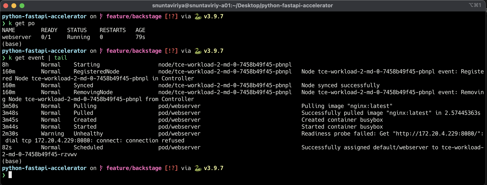

---
layout: post
title: "Kubernetes Liveness, Readiness Probe Explained"
author: guyzsarun
categories: [kubernetes]
image: assets/images/k8s-liveness-readiness/kubernetes.png
--- 

In Kubernetes, other than the `restartPolicy` which defaults to restart the pod when a pod fails. There are Liveness and Readiness probes to control and manage the lifecycle of a pod.

**Liveness Probe**

A liveness Probe is used by the `kubelet` to know when to restart the container inside a pod. This probe can help restart the container when the application is not responding to the request or the response time is too long.

There are 3 main ways to check the container's health using a liveness probe.

1. Liveness command 

    ```yaml
    apiVersion: v1
    kind: Pod
    metadata:
    name: webserver
    spec:
    containers:
      - name: nginx
        image: nginx:latest
        livenessProbe:
            exec:
                command:
                - cat
                - /tmp/healthy
            initialDelaySeconds: 3
            periodSeconds: 30
    ```

    We are creating an `nginx` container inside the pod `webserver`. The container has a `livenessProbe` attached to it.

    ```yaml
    exec:
        command:
        - cat
        - /tmp/healthy
    ```

    If the command under `exec` fails the kubelet will restart the container. In this case, if there is no file at `/tmp/healthy` the container will restart. 

    ```yaml
    initialDelaySeconds: 3
    ```

    The value `initialDelaySeconds` tells the kubelet to wait 3 seconds before performing the first probe. This is used to delay the probe when the container/application is starting up. Default is 0

    ```yaml
    periodSeconds: 30
    ```

    The value `periodSeconds` is the time between each probe. Default is 10

2. Liveness HTTP request

    ```yaml
    livenessProbe:
        httpGet:
            path: /healthz
            port: 8080
        initialDelaySeconds: 3
        periodSeconds: 30
    ```

    Replace the `exec` under `livenessProbe` with `httpGet`.  
    The kubelet will send a `GET` request to the `/healthz` endpoint on port `8080` of the container. If the handler returns a success code, the kubelet considers the container to be healthy. If the handler returns a failure code the `kubelet` will restart the container

3. TCP liveness probe

    ```yaml
    livenessProbe:
        tcpSocket:
            port: 8080
        initialDelaySeconds: 3
        periodSeconds: 30
    ```

    The probe will try to connect to the container on port `8080`. If the liveness probe fails, the container will be restarted.

**Readiness Probe**

A readiness probe is used by the `kubelet` to know when the container is ready to accept traffic. If the pod is not ready it is removed from the pool of backend for Services.
When we run `kubectl get po`  we can see if the container is ready for traffic in the `READY` field


```yaml
readinessProbe:
    tcpSocket:
        port: 8080
    initialDelaySeconds: 3
    periodSeconds: 30
```

We can simply use the same configuration as the `livenessProbe` by just changing it to `readinessProbe`  




In this example, we can see that the container is not ready to accept the traffic. And when we get the k8s event, we can see that the Readiness probe has failed to get port `8080` marking the container not ready.

**Startup probes**

In some cases, legacy applications or services require more startup time than modern applications. It can be hard to optimize all the parameters of `liveness` and `readiness` probe, startup probe can be used to cover the startup time.

```yaml
livenessProbe:
  httpGet:
    path: /healthz
    port: 8080
  failureThreshold: 1
  periodSeconds: 10

startupProbe:
  httpGet:
    path: /healthz
    port: 8080
  failureThreshold: 30
  periodSeconds: 10
```

Similar to `livenessProbe` and `readinessProbe` the  `httpGet`, `exec` and `tcpSocket` can be use. This startup probe can cover up to `failureThreshold * periodSeconds` of startup time. 

```yaml
failureThreshold: 30
```

The value `failureThreshold` is the number of trials that Kubernetes will try probing before giving up. Default is 3 

Once the startup probe has succeeded once, the `livenessProbe` will start to monitor the container. In this example, the application will have a window of 30 * 10 = 5 mins to perform its initialization.

