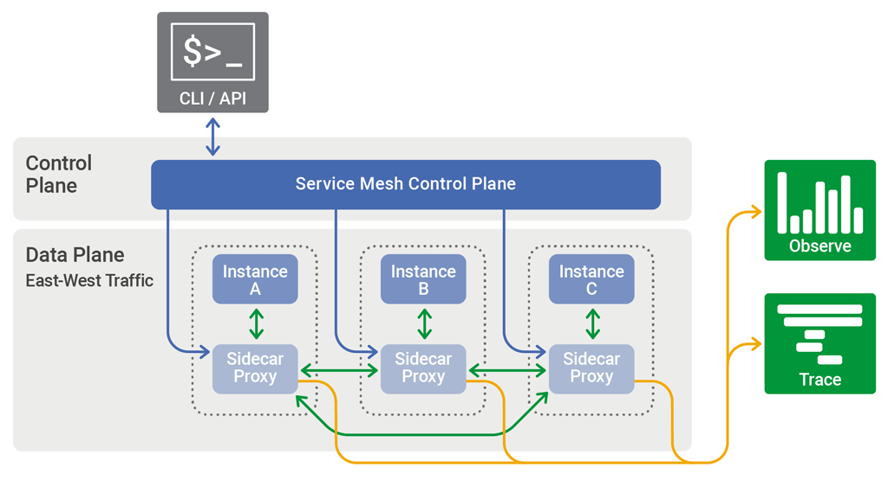
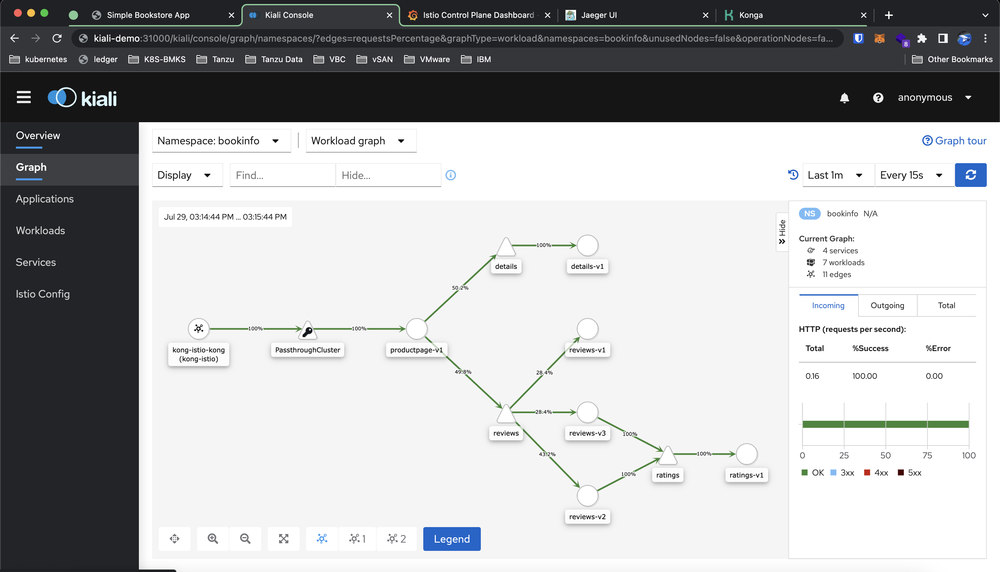
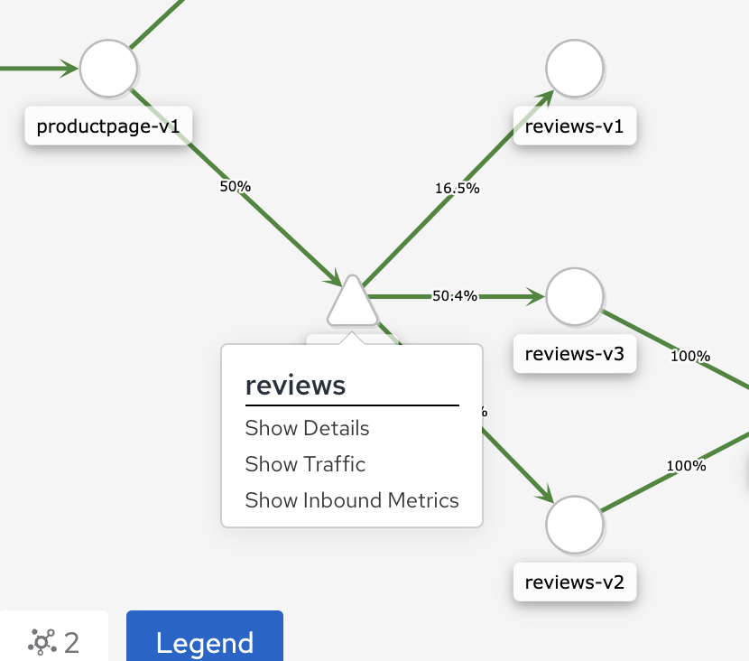
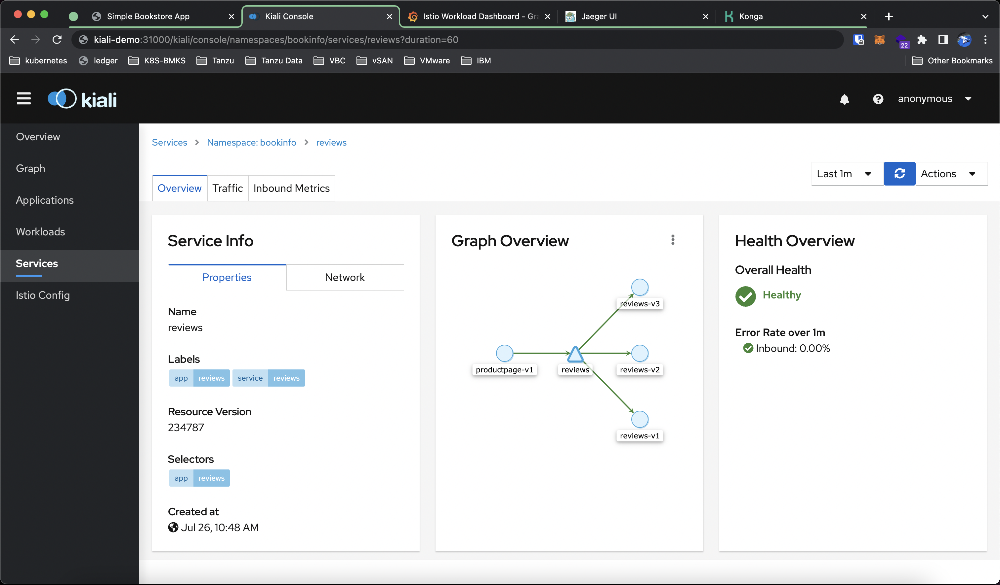
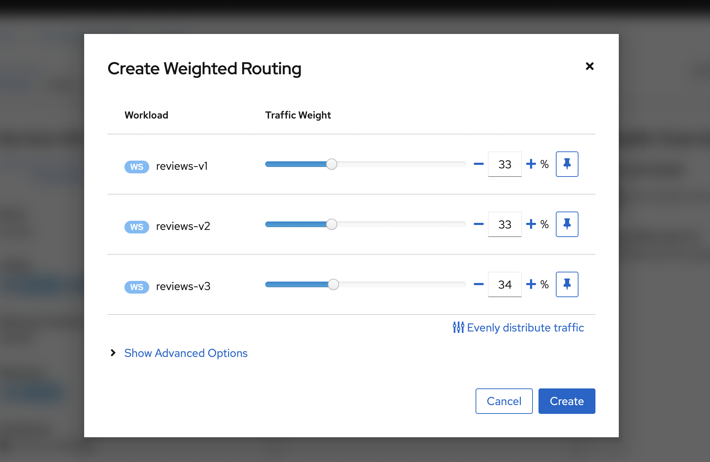
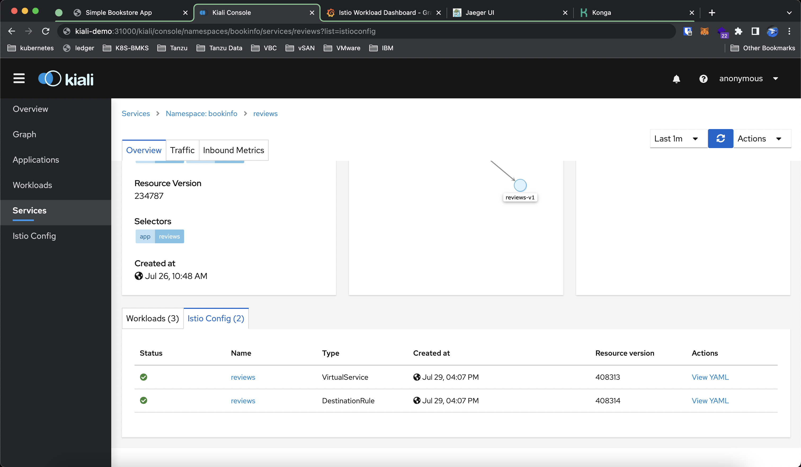
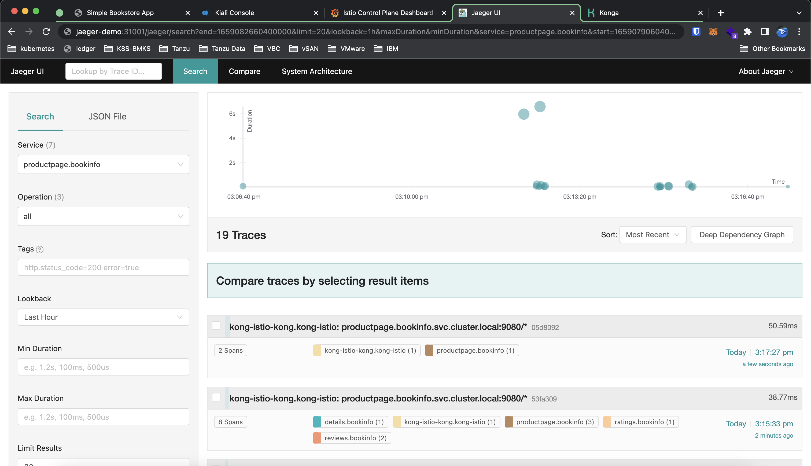
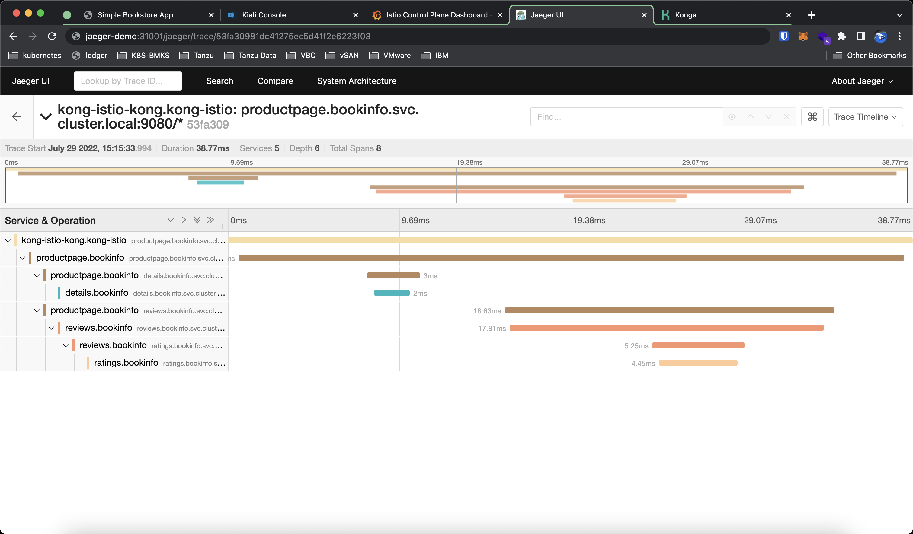

**What is Istio?**  
To fully understand Istio, you need to understand the concepts of Service Mesh. A service mesh is a dedicated infrastructure layer that adds a way to control the traffic between services or applications. Modern Applications nowadays mostly are in a form of multiple microservices connected together. A Service Mesh allows us to add some features like observability, traffic management, and security over the traffic between the services without modifying the application. Istio is one implementation of an open-source service mesh in Kubernetes.



**Installing Istio**  
There are many ways to install Istio such as the [Istio Operator](https://istio.io/latest/docs/setup/install/operator/), [Helm](https://istio.io/latest/docs/setup/install/helm/), and install in a [VM](https://istio.io/latest/docs/setup/install/virtual-machine/).

One of the easiest ways to install Istio is to use the Istioctl command line tool. Download the Istioctl from the [Istio Release Page](https://github.com/istio/istio/releases) and install it on your local machine.

Simply select your target Kubernetes cluster and run the following command to install Istio using the Demo profile. 
> View the component of each profile [here](https://istio.io/latest/docs/setup/additional-setup/config-profiles/).

```bash
❯ istioctl install --set profile=demo
```

Check if the installation was successful by running the following command.

```bash
❯ kubectl get deploy -n istio-system

NAME                   READY   UP-TO-DATE   AVAILABLE   AGE
istio-egressgateway    1/1     1            1           34s
istio-ingressgateway   1/1     1            1           34s
istiod                 1/1     1            1           30s
```

**Envoy Sidecar Injection**

For Istio to work, you need to enable Envoy Sidecar Injection. By default, Istio Envoy Sidecar Injection is disabled. To enable sidecar injection we have to add the following `label` to the namespace we want to use Istio.

```bash
❯ kubectl label namespace default istio-injection=enabled

namespace/default labeled
```

Test the Sidecar Injection by creating a pod in that namespace.

```bash
❯ kubectl run tmp --image=nginx

❯ kubectl get po
NAME   READY   STATUS            RESTARTS   AGE
tmp    0/2     PodInitializing   0          7s
```

We can see 2 containers running in the `tmp` pod. The first container is the Envoy sidecar that is injected by Istio and the second container is our nginx container.


**Istio Addons**  
Istio has multiple addons which are not installed by default. To enable the addons, we can apply the YAML file listed in the [Istio add-ons repository](https://github.com/istio/istio/tree/master/samples/addons).  
**Available add-ons:**
- **Prometheus** : Monitoring and time series database
- **Grafana** : Dashboard and Monitoring
- **Kiali**  : Observability console
- **Jaeger** : Distributed tracing
- **Zipkin** : Distributed tracing

**Deploy Sample Application**  
We can test our Istio service mesh by deploying a sample application.
```bash
❯ kubectl apply -f https://raw.githubusercontent.com/istio/istio/release-1.14/samples/bookinfo/platform/kube/bookinfo.yaml

service/details created
serviceaccount/bookinfo-details created
deployment.apps/details-v1 created
service/ratings created
serviceaccount/bookinfo-ratings created
deployment.apps/ratings-v1 created
service/reviews created
serviceaccount/bookinfo-reviews created
deployment.apps/reviews-v1 created
deployment.apps/reviews-v2 created
deployment.apps/reviews-v3 created
service/productpage created
serviceaccount/bookinfo-productpage created
deployment.apps/productpage-v1 created
```

**Kiali**

To view the current architecture of our sample application we can use Kiali. In the dashboard, we can view the relationships between the services of the sample application. It also provides filters to visualize the traffic flow such as Request per second, Request percentage, and Response time.



Apart from viewing how traffic flow between services, we can control how we forward the traffic to services. In the example, the `productpage-v1` calls the `review` service which will equally distribute the request between 3 versions of backend pod `v1`, `v2`, and `v3` If we want to control or add weighting we can do that by creating `VirtualService` and `DestinationRule`.

Right-click the `reviews` service icon and select Show Details.


View the Service Information as well as the Inbound and Outbound traffic. The current config has No `VirtualService` and `DestinationRule`. Click Actions and choose Weighted Routing to apply weighting to our service.


Update the weight of each backend pod, The total weight must equal 100


`VirtualService` and `DestinationRule` are created to update the traffic flow according to our config.


**Jaeger**

To trace the traffic between services we can use Jaeger. In the dashboard, we can select the service we want to trace on the left pane and visualize the traffic flow on the right pane.



To view a specific trace we can select a request we want to trace. The trace is comprised of a list of spans, where each span is a service that is invoked/called during the request.

