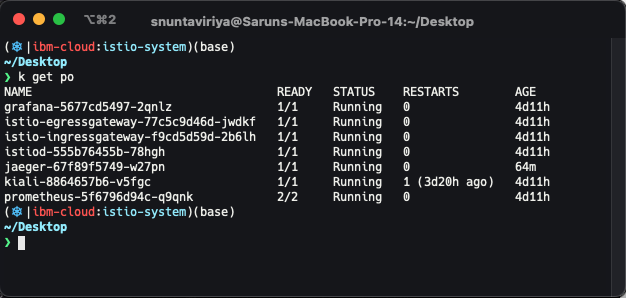
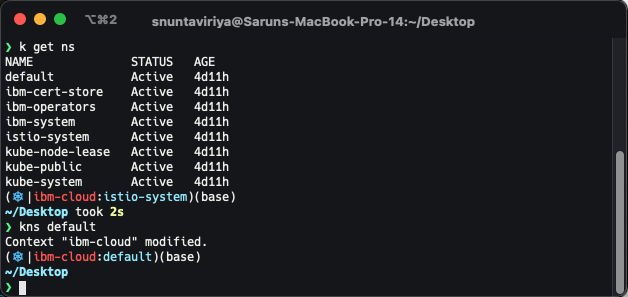
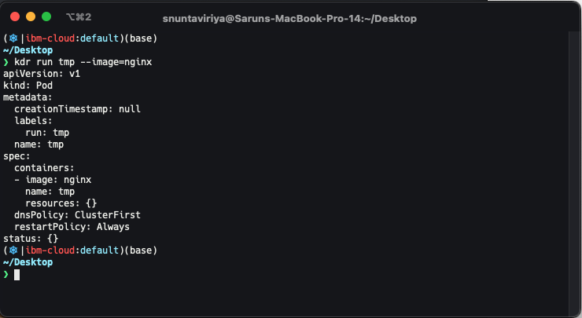
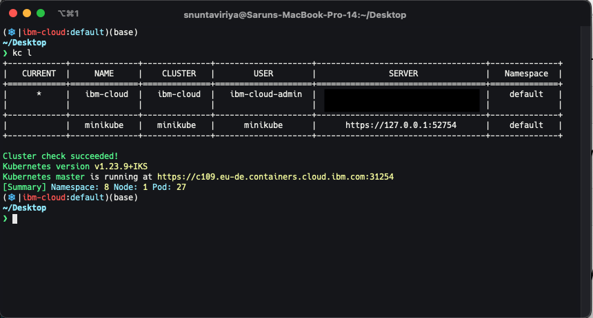
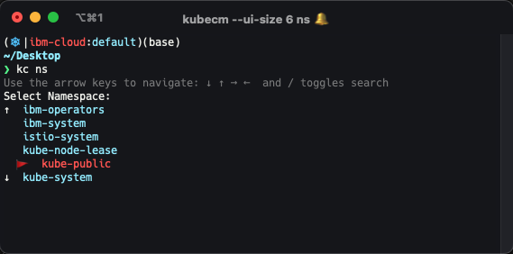
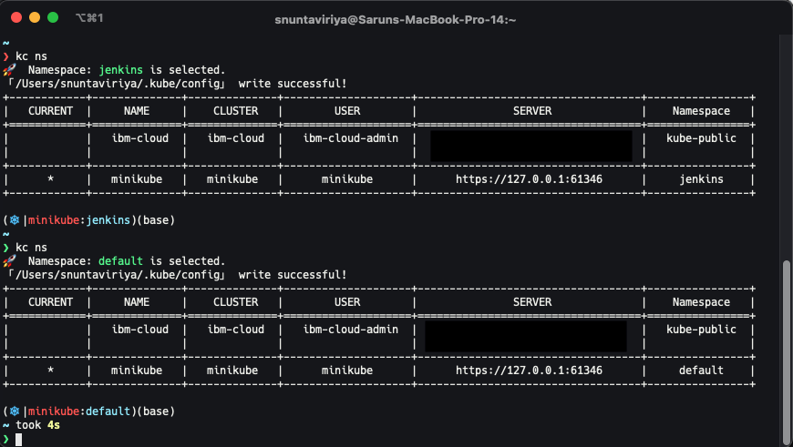
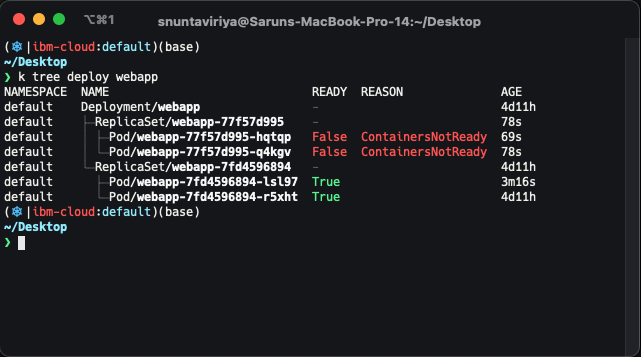

Managing multiple Kubernetes clusters is a pain. From switching between multiple clusters and managing applications and microservices deployed in multiple namespaces. Here are some commands and tools I use every day to help manage multiple Kubernetes clusters.

**Aliasing**  

Some basic aliasing can help speed up the process of deploying and managing Kubernetes clusters.
Here is some aliasing that I use almost every day.

Aliasing just the simple `kubectl` can save lots of time since we type them in front of every k8s command.
```bash
alias k=kubectl
```


A namespace is useful in separating different components and applications in a Kubernetes cluster, but it can be a pain to specify the namespace every time.

For example, if we want to get the pods in the `istio-system` namespace 
```bash
kubectl get pod --namespace istio-system
```
  
Permanently saving the namespace for all subsequent `kubectl` commands in the context can reduce lots of time and typos.
```bash
alias kns='kubectl config set-context --current --namespace'
```
In the example, when we run `kns default` we switched to the `default` namespace for all of the subsequent `kubectl` commands for that cluster.


Using `--dry-run=client` and outputting it as `yaml` file can quickly generate the yaml for a Kubernetes resource without actually applying it.

```bash
alias kdr='kubectl --dry-run=client -o yaml'
```



**kubecm**

[kubecm](https://github.com/sunny0826/kubecm) is great for visualizing and managing multiple Kubernetes clusters in your kubeconfig file.

To install simply run
```bash
brew install kubecm

alias kc='kubecm'
```

You can list all your Kubernetes clusters as a table along with the server and the current namespace by using `kc list` or `kc l`.



Also, you can interactively select clusters and namespaces to switch between them by typing `kc ns`. Searching is also possible in case you have lots of clusters and namespace to manage.



Apart from this, kubecm can also be used to create, delete and merge multiple kubeconfig files.

**kube-ps1**  

[kube-ps1](https://github.com/jonmosco/kube-ps1) is a shell script that simply adds Kubernetes Cluster and Namespace information to the prompt. It is very useful for quickly viewing your current cluster and namespace to make sure you deployed stuff in the right place.

To install simply run
```bash
brew install kube-ps1

source "/opt/homebrew/opt/kube-ps1/share/kube-ps1.sh"
PS1='$(kube_ps1)'$PS1
```

In the example below, initially, we are in the `jenkins` namespace in the `minikube` cluster. Then we switch to the `default` namespace we can see that the shell prompt is updated accordingly. 


**kubectl-tree**

[kubectl-tree](https://github.com/ahmetb/kubectl-tree) is a tool to observe the hierarchy and status of Kubernetes objects in a tree format. It is useful for visualizing the hierarchy of objects in a namespace and debugging Kubernetes objects. This tool comes in handy when you are trying to manage complex object hierarchies such as in [knative](https://knative.dev/docs/).

To install simply run
```bash
kubectl krew install tree
```
We can see the object tree that which deployments are managing which replicasets and pods.

