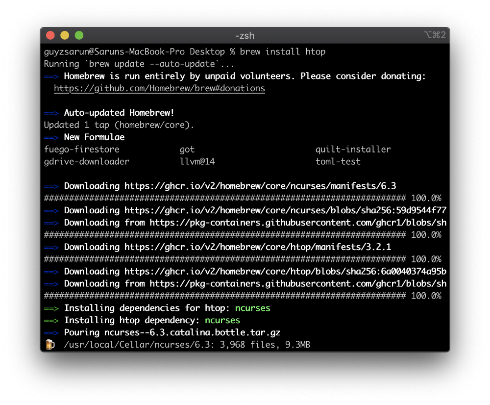
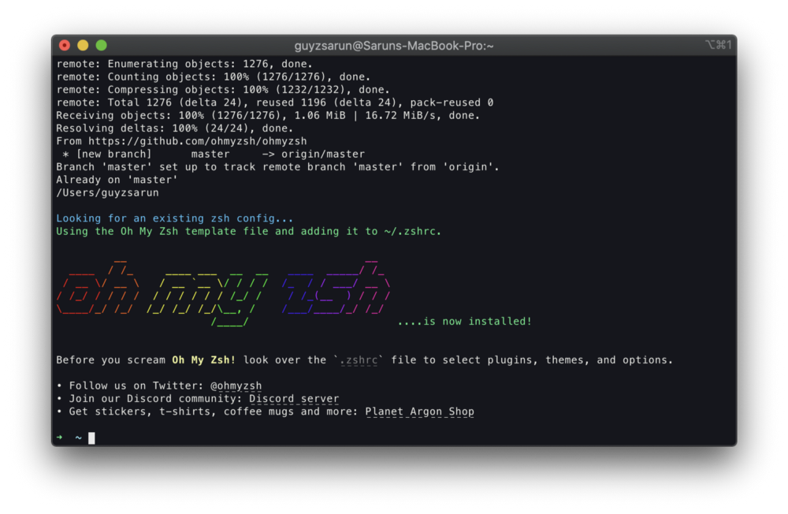
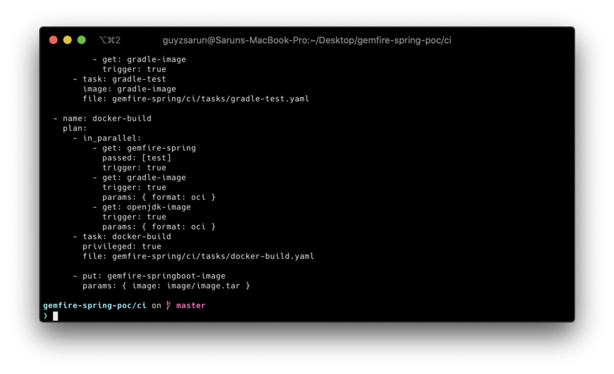
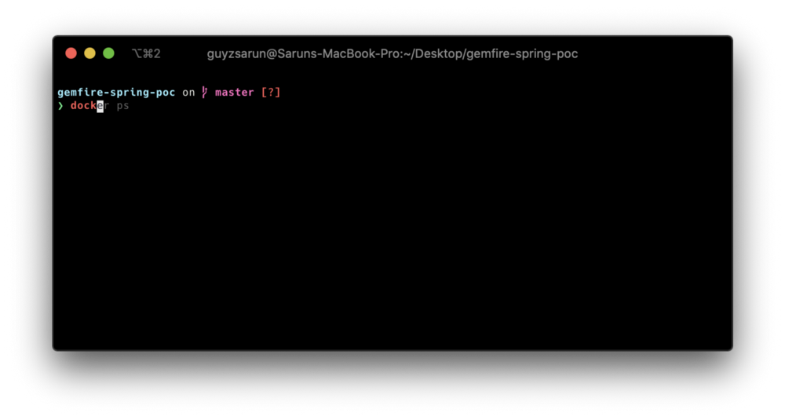
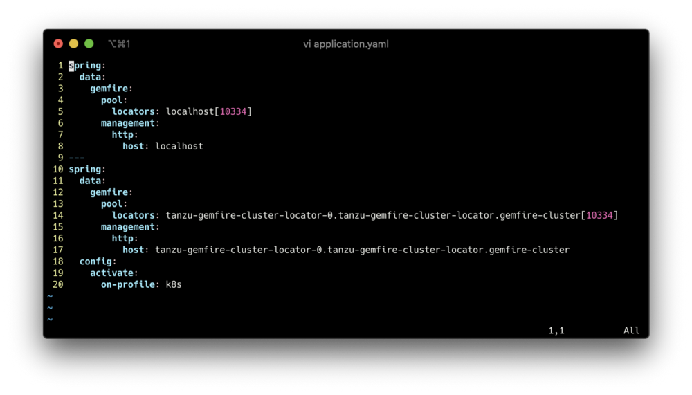
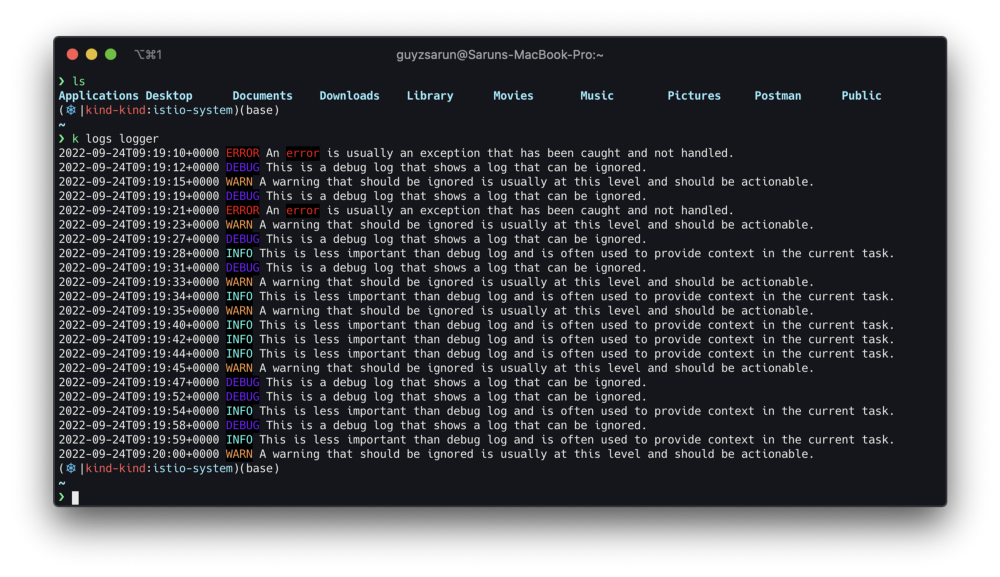
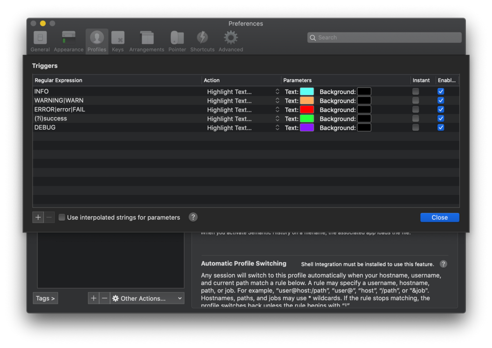
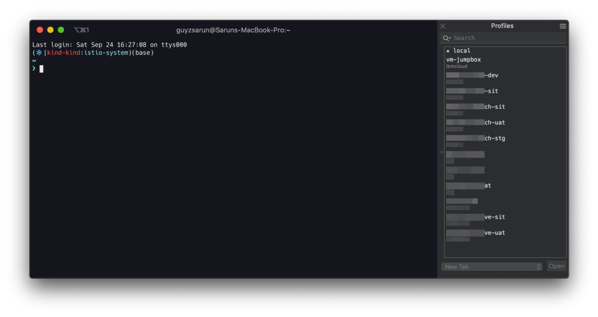
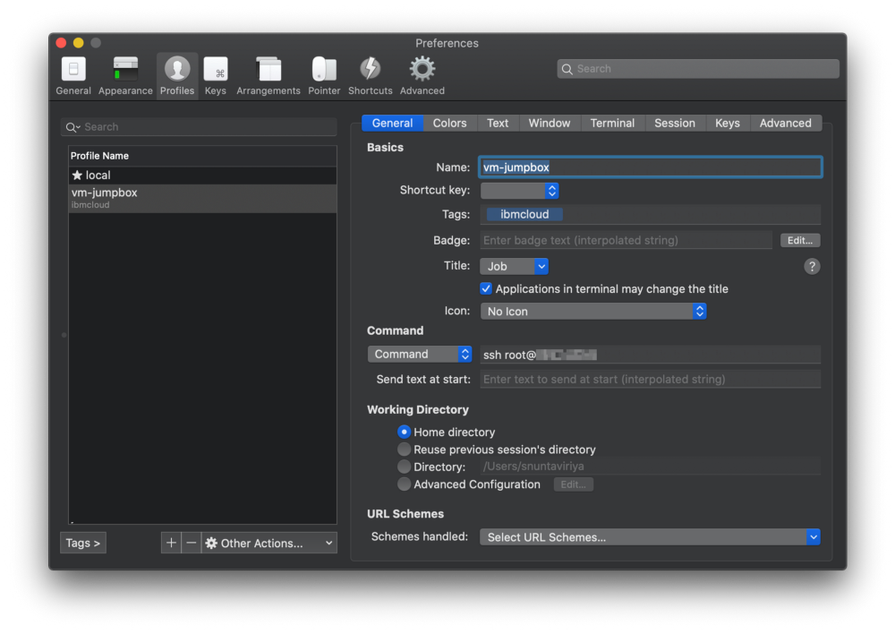
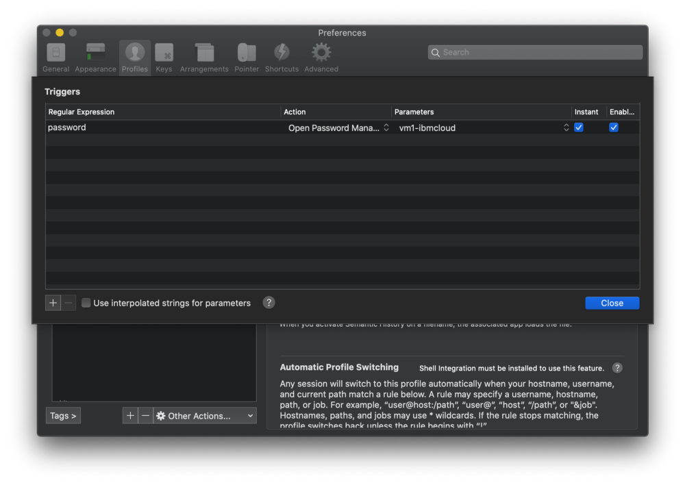

If you spend lots of time on your mac Terminal, maybe it's time to refresh it a bit. Some tools and packages will help you get the most out of your terminal.

## iTerm2

First, we will install iTerm2 to replace our default terminal, simply download it from [iTerm2 Website](https://iterm2.com/downloads.html). Extract the zip file, and drag it to the Applications folder.

## Homebrew


Next is Homebrew which is a package manager for macOS. Homebrew simplifies the installation and dependency management of many software and packages on macOS. 
To install simply run
```sh
/bin/bash -c "$(curl -fsSL https://raw.githubusercontent.com/Homebrew/install/HEAD/install.sh)"
```
For example, if we want to install htop to monitor CPU, RAM, and Swap usage, we can run brew install htop Homebrew will download and install the package for you.
brew install commandsSome other useful packages



#### jq

`jq` command is used extensively for managing JSON data in scripting.
```sh
brew install jq
```

#### wget

`wget` command can be used to download files from the internet using various protocols such as HTTP and HTTPS.
```sh
brew install wget
```


## Oh-My-Zsh



For Terminal Theme we'll use Oh-My-Zsh, which has tons of [Plugin](https://github.com/ohmyzsh/ohmyzsh/wiki/Plugins) and [Themes](https://github.com/ohmyzsh/ohmyzsh/wiki/Themes) for your terminal

To install Oh-My-Zsh run:
```sh
sh -c "$(curl -fsSL https://raw.github.com/ohmyzsh/ohmyzsh/master/tools/install.sh)"
```

### Themes

You can view and install Themes from the available list here.  
[Themes](https://github.com/ohmyzsh/ohmyzsh/wiki/Themes)  
[External-Themes](https://github.com/ohmyzsh/ohmyzsh/wiki/External-themes)


This is my iTerm2 after applying the Starship theme.

### Plugins

Here are some Plugins that I find very useful for your terminal

#### zsh-syntax-highlighting

From its name, this plugin highlight the syntax or command as you type it in the terminal
To install
```sh
git clone https://github.com/zsh-users/zsh-syntax-highlighting.git

echo "source ${(q-)PWD}/zsh-syntax-highlighting/zsh-syntax-highlighting.zsh" >> ${ZDOTDIR:-$HOME}/.zshrc
```

#### zsh-autosuggestions

To Install
```sh
git clone https://github.com/zsh-users/zsh-autosuggestions ${ZSH_CUSTOM:-~/.oh-my-zsh/custom}/plugins/zsh-autosuggestions
```

Then add zsh-autosuggestions in your plugin list ( inside `~/.zshrc` )



## vimrc

As I work with YAML file type all the time, setting the Tab config, Line number, and Syntax highlighting in vim is very helpful
Here is my ~/.vimrc config
```vim
set tabstop=2 softtabstop=2 shiftwidth=2
set expandtab
set number ruler
set autoindent smartindent
syntax enable
filetype plugin indent on
```



## iTerm2 Customization

There are many customizations that you can do with iTerm2, Here are a few

#### Highlight Text



We can customize the iTerm2 profile to highlight some text for us. We are using Regular Expression to trigger some Action.

Simply go to **iTerm2** -> **Preference** -> **Profiles** ( Select your profile ) -> **Advanced** and **Edit Triggers**

Add the Regex or Words that you want to trigger and Highlight Text action then select the color.



#### SSH Profile



Adding a profile for connecting to a remote machine can be very useful. You can create new Profiles and group them using Tags. Update the starting command to ssh username@ip to quickly connect to your remote machine on a new Tab whenever you open that profile.

> Use ⌘ + Shift + B to quickly brings up all your profile on the side



If you do not use ssh key to connect to your server, you can use **Triggers** with the word `password` to trigger the iTerm2 Password manager to autofill your password as well.

