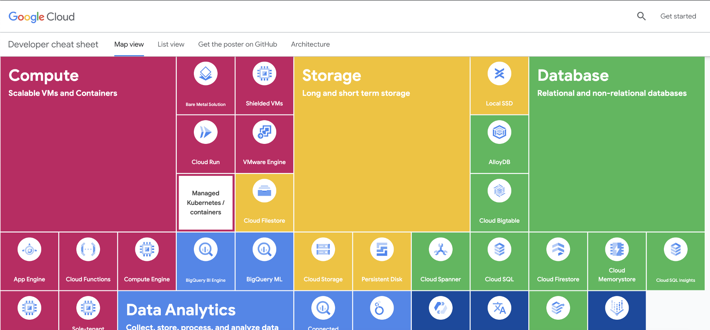
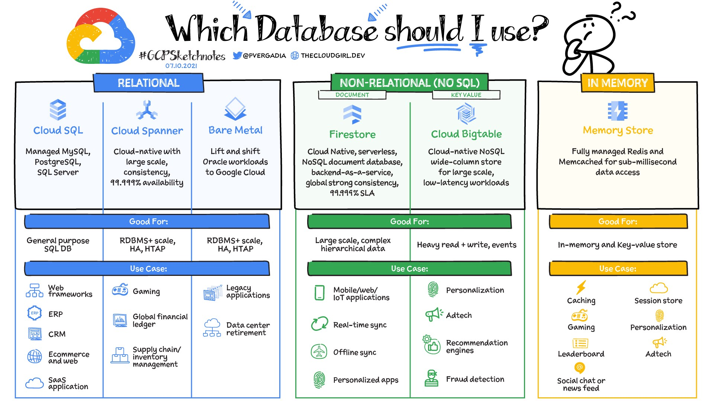
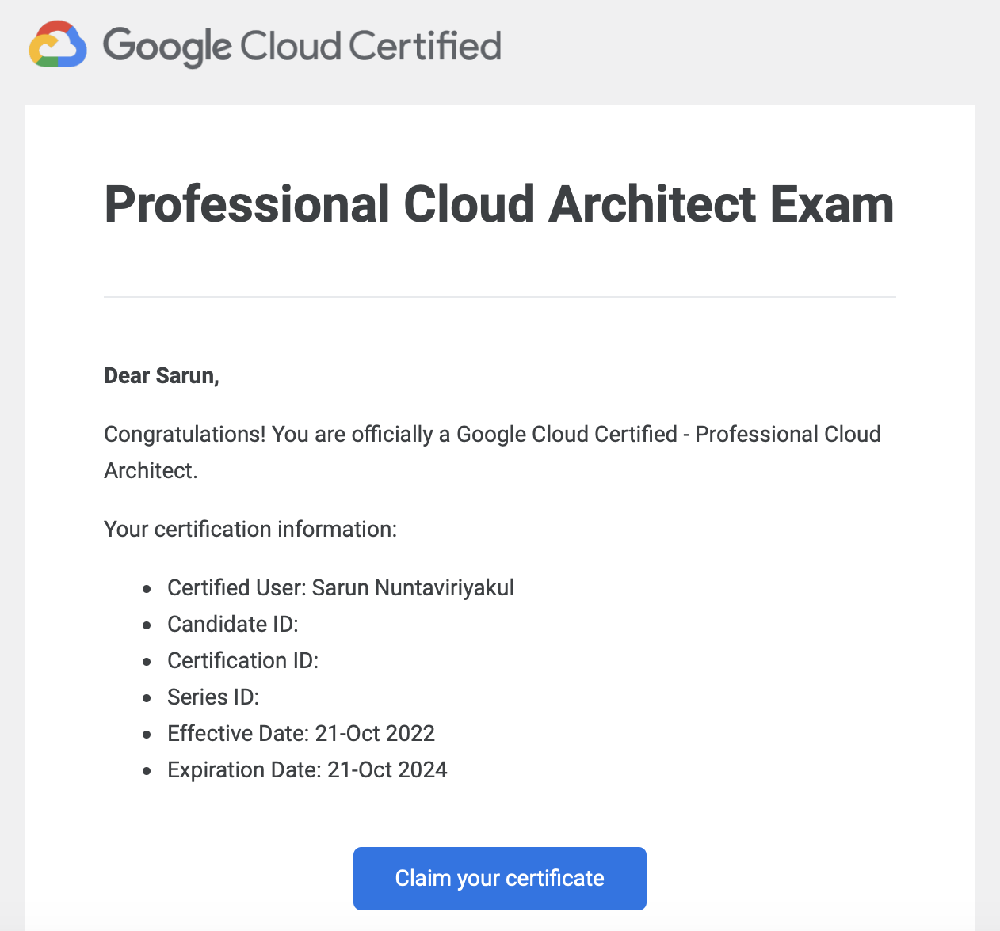

I recently passed the Google Cloud Professional Cloud Architect exam. The Google Professional Cloud Architect certification is an exam that one can take to demonstrate their knowledge of cloud architecture and Google Cloud.

Here are some useful links which I think would help you ace your PCA exam

---

## Google Cloud Developer Cheat Sheet

Containing products you should know before taking the exam, Google summarized all their products in just a few words.

[https://googlecloudcheatsheet.withgoogle.com/](https://googlecloudcheatsheet.withgoogle.com/)

## GCP Sketch note

Simple sketchnote and drawings from [The Cloud Girl](https://thecloudgirl.dev/) are one of the most straightforward notes I have read so far.

[https://github.com/priyankavergadia/GCPSketchnote](https://github.com/priyankavergadia/GCPSketchnote)

## 21 Products explained in a Minute

<iframe width="560" height="315" src="https://www.youtube.com/embed/videoseries?list=PLIivdWyY5sqIQ4_5PwyyXZVdsXr3wYhip" title="YouTube video player" frameborder="0" allow="accelerometer; autoplay; clipboard-write; encrypted-media; gyroscope; picture-in-picture" allowfullscreen></iframe>

[Cloud Bytes](https://www.youtube.com/playlist?list=PLIivdWyY5sqIQ4_5PwyyXZVdsXr3wYhip) youtube playlist explaining each Google Cloud product in under 2 mins

[https://cloud.google.com/blog/topics/inside-google-cloud/21-google-cloud-tools-each-explained-under-2-minutes](https://cloud.google.com/blog/topics/inside-google-cloud/21-google-cloud-tools-each-explained-under-2-minutes)

## Case studies

The exam consists of case studies which will be 1 of the following 4 below ( as of Oct 2022 ) 
Although you can read the case studies in the exam, it is better to read them before taking the exam to minimize the time.  

[EHR Healthcare](https://services.google.com/fh/files/blogs/master_case_study_ehr_healthcare.pdf): Migration to Google Cloud with Connectivity to on-prem resources.  
[Helicopter Racing League](https://services.google.com/fh/files/blogs/master_case_study_helicopter_racing_league.pdf): AI and ML for race predictions.  
[Mountkirk Games](https://services.google.com/fh/files/blogs/master_case_study_mountkirk_games.pdf): Multiplayer games on GKE, Dynamically scale on Multiple regions.  
[TerramEarth](https://services.google.com/fh/files/blogs/master_case_study_terramearth.pdf): Predict vehicle malfunction, increase development workflow

## Google Cloud Documentation

Containing multiple code samples, architectural diagrams, best practices, tutorials, and API references for each Google Cloud product.

[https://cloud.google.com/docs/](https://cloud.google.com/docs/)

[Preemptible VMs](https://cloud.google.com/compute/docs/instances/preemptible)  
[Spot VMs](https://cloud.google.com/compute/docs/instances/spot)  
[HA with regional disk](https://cloud.google.com/compute/docs/disks/high-availability-regional-persistent-disk)  
[Cloud Storage](https://cloud.google.com/blog/topics/developers-practitioners/all-you-need-know-about-cloud-storage)  
[Data Transfer](https://cloud.google.com/architecture/migration-to-google-cloud-transferring-your-large-datasets#transfer-options)  
[VPC Peering](https://cloud.google.com/vpc/docs/vpc-peering)  
[Network Tiers](https://cloud.google.com/network-tiers)  
[GKE](https://cloud.google.com/kubernetes-engine/docs/concepts/service)  
[Cloud Functions](https://cloud.google.com/functions)  
[Data Loss Prevention](https://cloud.google.com/dlp)  

## Sample questions

Review Practice questions to familiarize yourself with the exam format

[PCA Practice Questions](https://docs.google.com/forms/d/e/1FAIpQLSf54f7FbtSJcXUY6-DUHfBG31jZ3pujgb8-a5io_9biJsNpqg/viewform)

---

## Exam day

I schedule my Online Proctored exam through [Webassessor](https://www.webassessor.com/googlecloud/). The exam procedure is similar to [Pearson Vue](https://home.pearsonvue.com/) if you have taken the Microsoft Azure exam before.

- **Format**: Multiple Select & Multiple Choice
- **Number of Questions**: 50
- **Time**: 120 mins

You will get the results at the end of your test, (only Pass or Failed, no score shown)

About 5 days later you will get an email to claim your certificate and a code for accessing the google merchandise store to claim your swag.

Good Luck with your Exam 🍀